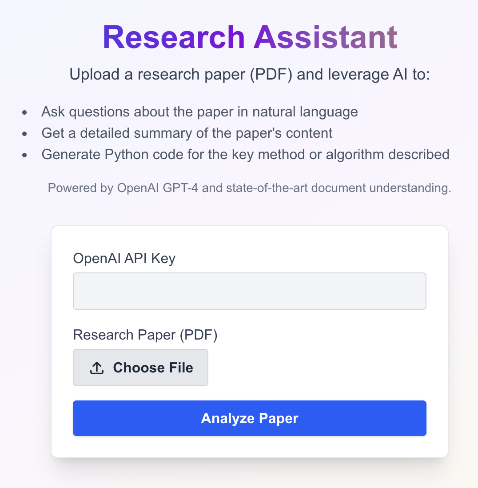

<p align = "center" draggable="false" >
</p>

## <h1 align="center" id="heading"> 🤖 Research Assistant - AI-Powered Paper Analysis</h1>

<p align="center">
  <strong>Transform Research Papers into Actionable Insights with AI-Powered Analysis</strong>
</p>

<p align="center">
  <a href="https://frontend-d9q17b3s8-dintellects-projects.vercel.app/" target="_blank">
    
  </a>
</p>

---

## 📋 Project Overview

The Research Assistant is an intelligent application that revolutionizes how researchers, businesses, and students interact with academic papers. By leveraging advanced AI and natural language processing, it transforms complex research documents into actionable insights, executable code, and comprehensive summaries.

### 🎯 **What Makes This Special**
- **Instant Analysis**: Upload any research paper and get insights in seconds
- **Code Generation**: Automatically create working Python implementations
- **Smart Citations**: Generate properly formatted academic citations
- **Interactive Q&A**: Chat naturally with your research papers
- **Enterprise Ready**: Scalable architecture for business deployment

---

## ✨ Features

### 🔍 **Smart Paper Analysis**
- **Advanced NLP Processing**: Intelligent content extraction and semantic understanding
- **Vector Embeddings**: FAISS-powered similarity search for context-aware responses
- **Multi-format Support**: PDF processing with PyPDF2 for reliable text extraction
- **Content Chunking**: Optimal segmentation for maximum AI comprehension

### 📝 **Intelligent Summaries**
- **Structured Output**: Introduction, Methods, Results, and Conclusion sections
- **Academic Formatting**: Professional summaries ready for publication
- **Reference Extraction**: Automatic identification of key sources and citations
- **Further Reading**: Curated suggestions for related research

### 💻 **Code Generation Engine**
- **Method Implementation**: Convert research methods into working Python code
- **Best Practices**: Production-ready code following industry standards
- **Documentation**: Comprehensive comments and docstrings
- **Error Handling**: Robust code with proper exception management

### 📚 **Citation Management System**
- **Auto-Extraction**: Identify authors, titles, journals, and publication details
- **Multiple Formats**: Generate citations in various academic styles
- **BibTeX Export**: Complete reference management integration
- **Accuracy Verification**: Cross-reference with academic databases

### 💬 **Interactive AI Chat**
- **Context-Aware Responses**: AI understands paper content and context
- **Natural Language**: Ask questions in plain English
- **Real-time Streaming**: Instant responses with live updates
- **Deep Analysis**: Probe specific sections, methods, or findings

### 🎨 **Modern User Experience**
- **Responsive Design**: Works seamlessly on desktop, tablet, and mobile
- **Dark Mode**: Eye-friendly interface for extended research sessions
- **Real-time Feedback**: Live progress indicators and status updates
- **Copy-to-Clipboard**: One-click copying of all generated content

---

## 🏢 Business Cases & Use Cases

### 🎓 **Academic Institutions**
- **Research Departments**: Accelerate literature reviews and paper analysis
- **Libraries**: Provide AI-powered research assistance to students and faculty
- **Graduate Programs**: Help students understand complex research papers
- **Publication Teams**: Streamline the review and citation process

### 💼 **Corporate R&D**
- **Technology Companies**: Stay ahead with rapid analysis of cutting-edge research
- **Pharmaceutical Firms**: Analyze clinical studies and medical research
- **Financial Services**: Monitor academic research on market trends and algorithms
- **Consulting Firms**: Provide clients with AI-enhanced research insights

### 🔬 **Research Organizations**
- **Government Labs**: Process large volumes of research papers efficiently
- **Non-profits**: Analyze research relevant to their mission and programs
- **Think Tanks**: Generate insights from academic literature for policy recommendations
- **Research Consortia**: Share AI-powered analysis across member organizations

### 📊 **Market Research & Competitive Intelligence**
- **Market Analysts**: Track academic research on emerging technologies
- **Strategy Teams**: Identify research trends that could impact business strategy
- **Product Managers**: Understand academic foundations of new technologies
- **Investment Firms**: Analyze research papers for investment opportunities

### 🏥 **Healthcare & Life Sciences**
- **Medical Researchers**: Rapid analysis of clinical studies and medical papers
- **Healthcare Providers**: Stay updated with latest medical research
- **Biotech Companies**: Analyze research papers for drug development insights
- **Medical Device Companies**: Understand academic research on new technologies

### 🎯 **Specific Business Scenarios**

#### **Scenario 1: Technology Company R&D**
*Challenge: A tech company needs to understand the latest research on quantum computing for product development.*

**Solution**: Upload relevant quantum computing papers → Get instant summaries → Generate code implementations → Chat with AI about specific applications

#### **Scenario 2: Investment Firm Research**
*Challenge: An investment firm needs to analyze academic research on emerging markets and technologies.*

**Solution**: Process multiple research papers → Extract key insights and trends → Generate market analysis reports → Identify investment opportunities

#### **Scenario 3: Consulting Project**
*Challenge: A consulting firm needs to provide clients with insights from academic research on industry trends.*

**Solution**: Upload industry-specific research → Generate executive summaries → Create presentation-ready insights → Provide detailed analysis with citations

---

## 🛠️ Technology Stack

### Backend Architecture
- **FastAPI**: High-performance, modern web framework with automatic API documentation
- **OpenAI GPT-4**: State-of-the-art language model for intelligent analysis
- **PyPDF2**: Robust PDF text extraction and processing
- **FAISS**: Facebook AI Similarity Search for efficient vector operations
- **NumPy**: Numerical computing and array operations
- **Uvicorn**: Lightning-fast ASGI server for production deployment

### Frontend Technology
- **Next.js 14**: React framework with App Router for optimal performance
- **TypeScript**: Type-safe development for better code quality
- **Tailwind CSS**: Utility-first CSS framework for rapid UI development
- **React Hooks**: Modern state management and side effects
- **Responsive Design**: Mobile-first approach for all devices

### DevOps & Deployment
- **Docker**: Containerized deployment for consistency across environments
- **Fly.io**: Global deployment platform for low-latency access
- **Environment Management**: Secure API key handling and configuration
- **CORS Configuration**: Cross-origin resource sharing for web integration

---

## 🚀 Quick Start

### Prerequisites
- **Python 3.8+** - Backend runtime environment
- **Node.js 18+** - Frontend development environment
- **OpenAI API Key** - Get from [OpenAI Platform](https://platform.openai.com/)

### Backend Setup

1. **Navigate to the API directory:**
   ```bash
   cd OpenAI-Research-Assistant/api
   ```

2. **Install Python dependencies:**
   ```bash
   pip install -r requirements.txt
   pip install python-multipart
   ```

3. **Start the backend server:**
   ```bash
   python app.py
   ```
   The API will be available at `http://localhost:8000`

### Frontend Setup

1. **Navigate to the frontend directory:**
   ```bash
   cd OpenAI-Research-Assistant/frontend
   ```

2. **Install dependencies:**
   ```bash
   npm install
   ```

3. **Start the development server:**
   ```bash
   npm run dev
   ```
   The app will be available at `http://localhost:3000`

---

## 📖 Usage Guide

### 1. **Upload and Analyze**
- Enter your OpenAI API key (securely stored locally)
- Click "Choose File" to select a PDF research paper
- Click "Analyze Paper" to begin AI-powered processing
- Watch real-time progress as the AI processes your document

### 2. **Explore Insights**
- **💬 Chat**: Ask natural language questions about the paper
- **📝 Summary**: Get comprehensive, structured summaries
- **💻 Code**: Extract or generate Python implementations
- **📚 Citation**: Get formatted citations and BibTeX entries

### 3. **Export and Use**
- Copy any result to clipboard with one click
- Download generated code as ready-to-run Python files
- Export citations for your reference management system
- Share insights with your team or stakeholders

---

## 🔧 API Documentation

### Core Endpoints

| Endpoint | Method | Description | Use Case |
|----------|--------|-------------|----------|
| `/api/upload-paper` | POST | Upload and process PDF papers | Initial paper analysis |
| `/api/get-summary` | GET | Get detailed paper summary | Generate executive summaries |
| `/api/get-code` | GET | Extract/generate Python code | Code implementation |
| `/api/get-citation` | GET | Get citations and BibTeX | Reference management |
| `/api/chat` | POST | Interactive chat about paper | Q&A and deep analysis |
| `/api/ask-question` | POST | Ask specific questions | Targeted research queries |

### Advanced Features
- **Streaming Responses**: Real-time data flow for better UX
- **Error Handling**: Comprehensive error management and recovery
- **Rate Limiting**: Built-in protection against API abuse
- **CORS Support**: Cross-origin requests for web integration

### API Documentation
Once running, access interactive docs at:
- **Swagger UI**: `http://localhost:8000/docs`
- **ReDoc**: `http://localhost:8000/redoc`

---

## 🚀 Deployment

### Local Development
```bash
# Backend
cd api && python app.py

# Frontend  
cd frontend && npm run dev
```

### Production Deployment
```bash
# Using Docker
docker build -t research-assistant .
docker run -p 8000:8000 research-assistant

# Using Fly.io
fly deploy
```

### Environment Variables
```bash
OPENAI_API_KEY=your_api_key_here
CORS_ORIGINS=http://localhost:3000,https://yourdomain.com
```

*Built with ❤️ using FastAPI, Next.js, and OpenAI GPT-4*

**⭐ Star this repository if you found it helpful!**
